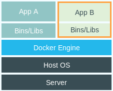

## Docker introduction


---

### problem during working

* Run whole production stack locally
* Different environment between dev and prod
* Sandbox
* Better resource utilization


Note:
Run whole production stack locally(依赖过多，很难做自动化测试, 模块化）, Different environment(tricky的方式安装很多软件)
sandbox，比如OOM，比如try之前封装的有内存泄漏的算法库, utilization(可以更多的压榨服务器资源，节约成本，就可以压低产品单价)

---

### What is Docker?


<iframe src="https://ghbtns.com/github-btn.html?user=docker&repo=docker&type=star&count=true" frameborder="0" scrolling="0" width="170px" height="20px"></iframe>

----

### What is Docker?
Open platform for developers and operatation to build, ship, and run distributed applications

Note:
Docker 最初是 dotCloud 公司内部项目,在 2013 年底，dotCloud 公司决定改名为 Docker。
Docker 最初是在 Ubuntu 12.04 上开发实现的；Red Hat 则从 RHEL 6.5 开始对 Docker 进行支持
它提供的是一种容器虚拟化技术，同传统的虚拟机相比(aws, aliyun)不同，因此容器要比传统虚拟机更为轻便。


----

### TRADITIONAL VM VS. DOCKER

Note:
传统虚拟机技术是虚拟出一套硬件后，在其上运行一个完整操作系统，在该系统上再运行所需应用进程；而容器内的应用进程直接运行于宿主的内核，容器内没有自己的内核，而且也没有进行硬件虚拟。


----


Note:
镜像（Image）和容器（Container）的关系，就像是面向对象程序设计中的类和实例一样，镜像是静态的定义，容器是镜像运行时的实体。容器可以被创建、启动、停止、删除、暂停等。

registry就是存储docker镜像的仓库，docker官方提供公有云服务，名字是docker hub，从名字就可以听出来，类似github的，其实docker的命令行操作也和git很像。有git使用经验的人很快就可以上手docker操作。当时docker hub毕竟是公有云服务，不管是速度还是安全性都不太适合企业来使用，所以我们搭建了自己的private docker registry

docker daemon现在可以运行在 linux，windows和macos上。特别值得一提的是在macos上，安装十分简单, 大家都可以玩玩。

----

### how to achieve it?

* CGroup
* Namespace
* UnionFS

Note:
很多人都觉得Docker是个新技术，其实不然，Docker除了其编程语言用go比较新外，其实它还真不是个新东西，也就是个新瓶装旧酒的东西
Control Group是Linux内核的一个功能，用来限制，控制与分离一个进程组群的资源（如CPU、内存、磁盘输入输出等）。这个项目最早是由Google的工程师在2006年发起
Namespace是Linux提供的一种内核级别环境隔离的方法。每个容器都有自己单独的命名空间，运行在其中的应用都像是在独立的操作系统中运行一样。命名空间保证了容器之间彼此互不影响。
不知道你是否还记得很早以前的Unix有一个叫chroot的系统调用（通过修改根目录把用户jail到一个特定目录下），chroot提供了一种简单的隔离模式：chroot内部的文件系统无法访问外部的内容。Linux Namespace在此基础上，提供了对UTS、IPC、mount、PID、network、User等的隔离机制。
UnionFS支持对文件系统的修改作为一次提交来一层层的叠加，同时可以将不同目录挂载到同一个虚拟文件系统下。Docker 镜像的基础。镜像可以通过分层来进行继承，基于基础镜像，可以制作各种具体的应用镜像。
docker的分层镜像技术，aufs，btrfs, devicemapper和vfs，

----

### HOW DO I USE IT?


---

### WHAT WE'VE LEARNED SO FAR?
* Container - Light weight virtualization
* Image - Immutable snapshot of a container
* Registry - Central hub for sharing images

----

### how to run containers?

```
user@host:/$ docker run -it ubuntu /bin/bash
```

```
user@host:/$ docker run -d -t mysql
```

```
user@host:/$ docker run -d -t mysql:5.6
```

----

### MANIPULATING CONTAINERS

```
user@host:/$ docker ps
```

```
CONTAINER ID  IMAGE  COMMAND      CREATED     STATUS
d2a7cd9cd8b2  ubuntu "/bin/bash"  1 mins ago  Up 1 mins
```

```
user@host:/$ docker logs d2a7cd9cd8b2
```

```
user@host:/$ docker stop d2a7cd9cd8b2
```

```
user@host:/$ docker start d2a7cd9cd8b2
```

----

### IMAGES - MANUAL CREATION

```
user@host:/$ docker run -i -t debian /bin/bash
```

```
root@container:/$ apt-get install mysql
```

```
user@host:/$ docker ps
```

```
user@host:/$ docker commit <CID> docker.megvii.com/mysql
```


----

### Registry

```
user@host:/$ docker login
```

```
user@host:/$ docker push docker.megvii.com/mysql
```

```
ysw@sweetie-home:/$ docker pull docker.megvii.com/mysql
```

----

### IMAGES - DOCKERFILES

```
FROM python:2.7
ENV PYTHONUNBUFFERED 1
ADD . /code/
WORKDIR /code
RUN pip install -r requirements.txt
CMD python manage.py server
```

----

### DOCKERFILES

```
user@host:/$ docker build -t mc-backend:v1.0.0 .
```

----

### WHAT ABOUT PORTS?

```
user@host:/$ docker run -d -p 3306:3306 mysql
```

```
"-p host_port:container_port"
```

----

### WHAT ABOUT DATA?

```
user@host:/$ docker run -d -p mysql:mysql \
    -v `pwd`/data:/var/lib/mysql\
    -t mysql

```

```
"-v host_dir:container_dir"
```

----

### EVERYONE ON THE TEAM RUNS THE SAME DATABASE, C LIBRARIES, CACHE, OPENSSL...

----

### docker compose
https://github.com/docker/compose

```
services:
  facid-frontend:
    build: .
    ports:
     - "5000:5000"
    volumes:
     - .:/code
    command: ['python', 'manage.py', 'runserver']
  redis:
    image: "redis:alpine"
  mysql:
    image: "mysql:5.6"
  ...
```


---

### ready for production?

Note:

Docker可以应用于生产环境的。但需要：
1、需要知道Docker不是包治百病。适合的业务跑docker
2、需要有成熟的管理工具和私有DockerHub
3、生产环境关心的主要是：监控、日志、变更、扩容，这些问题都需要在头脑里知道怎么解决。

---

### BUILD ONCE AND RUN ANYWHERE


---

## Thanks
