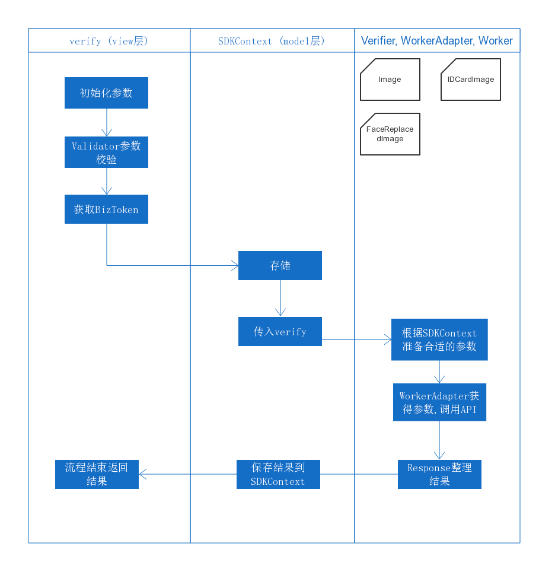

# Verify 模块重构

#### 技术评审

###### Created by :green_heart: Zhou Changzhi, Wang Ruoxuan

---

# ~~关于重构~~ 关于单元测试


---
# 代码的坏味道:shit:

---
## DuplicatedCode
```python
if faceid_images['error'] == 'no such person':
    g.log.update({'source_type': faceid_images['source_type']})
    raise RespNoSuchIdNumber()
elif faceid_images['error'] == 'no match':
    g.log.update({'source_type': faceid_images['source_type']})
    raise RespIdNumberNameNotMatch()
elif faceid_images['error'] == 'no photo':
    g.log.update({'source_type': faceid_images['source_type']})
    raise RespInvalidImageFormat('data_source')
elif faceid_images['error'] == 'no face found':
    g.log.update({'source_type': faceid_images['source_type']})
    raise RespNoFaceFound('data_source')

```
---

## LongMethod
```python
@api_method('/faceid/v2/verify', taskname='verify', 
            methods=['POST'], api_version='v2')
def verify():
    g.resp.update({'request_id': g.request_id})
    # Parameter preparation
    api_key, comparison_type, face_image_type = get_arguments(
    	['api_key', 'comparison_type', 'face_image_type'])

# ... 以下省略 400 行
```
---

## LongParameterList
``` python
class api_method(object):

    def __init__(self, url_rule, permission_required=[],                        needlog=True, log_result=True,
                 hidden=False, endpoint=None, taskname=None,
                 api_version=None, api_type=API_TYPE_READ,
                 **kwargs):

```
---

## Magic Number

```python
decoded_delta, _ = decode_delta(delta, 0)
```
---

## Naming

```python
def read_file(filename):
    with open(filename, 'r+') as f:
        rv = f.read()
        f.write('xxxx')
    return f
```
---
## 其他

* `flask.g`
* 模块分层和单一职责
* 关于注释
* 一个函数只干一件事情

---

# 开始重写

---

## 代码拆解

* 参数校验
* 取照片
* Verify
	* Comparison: Detect -> Extract -> Compare
	* FaceReplaced: Detect -> Extract -> Compare -> Decision
	* FMP: liveness
* Response

---

### 参数校验

```python
class TokenValidator(schema):
    api_key = String()
    notify_url = String(required=False)
    biz_no = String(default='1234')
    verbose = Int(validate=lambda x: x in VERBOSE_LEVELS)
    security_level = Int(authenticate='has_security_perm')
```
---

## 抽象

* Image
* Face
* Context

---
### Image
```python
class Image(Base):
    def __init__(self, image_id, name):
        self.image_id = image_id
        self.name = name
        self.face = None
        self.watermark = None
        self._file = None

    @property
    def file(self):
        if self._file is None:
            content = encryptfs.get_content(self.image_id)
            stream = StringIO(content)
            self._file = File(self.image_id, stream)
        return self._file

```
---
## Unit Test
* Tiny bit of functionality and prove it correct
* Run fast :rocket:
* 83 test cases. Less than 30 seconds

---

# 重写后的Verify
by :sunny: Wang Ruoxuan

---


---
## 代码分析 [link](https://git-pd.megvii-inc.com/cloudDEV/faceid-backend/blob/new-api/app/views/api/v3/mobile_sdk/verify_internal.py)
---

# Q&A