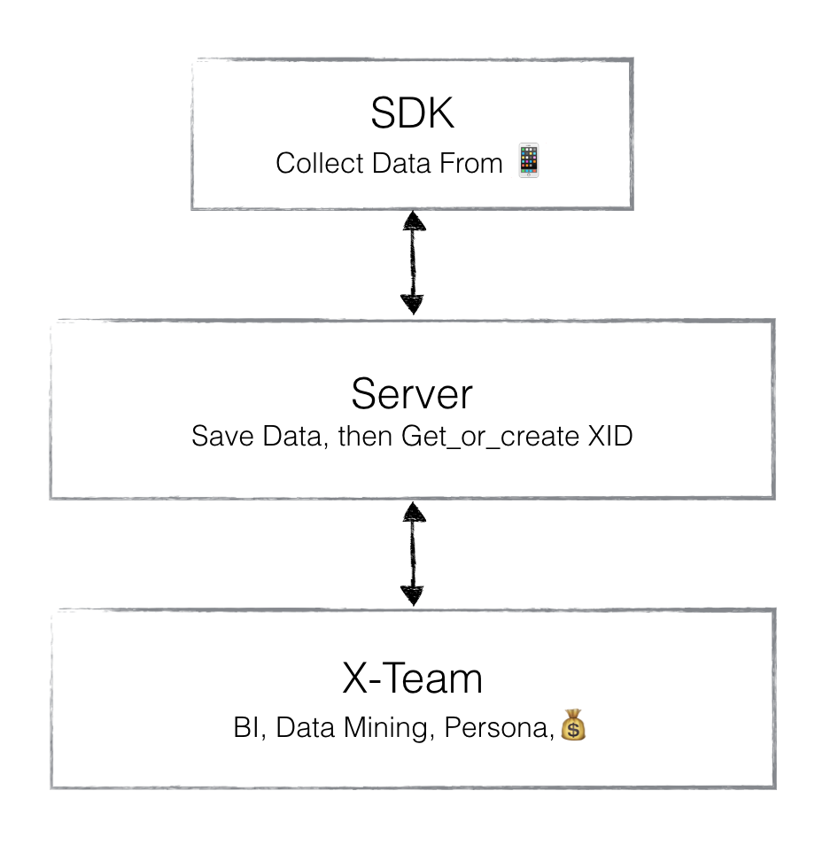
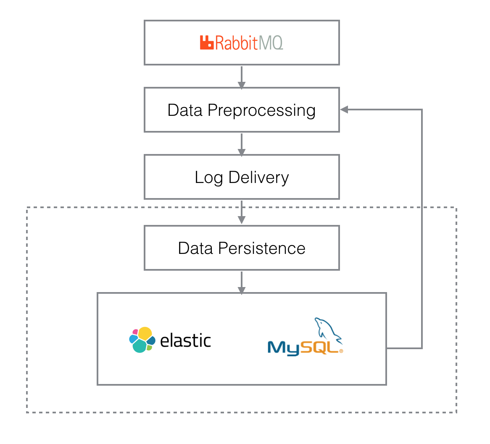
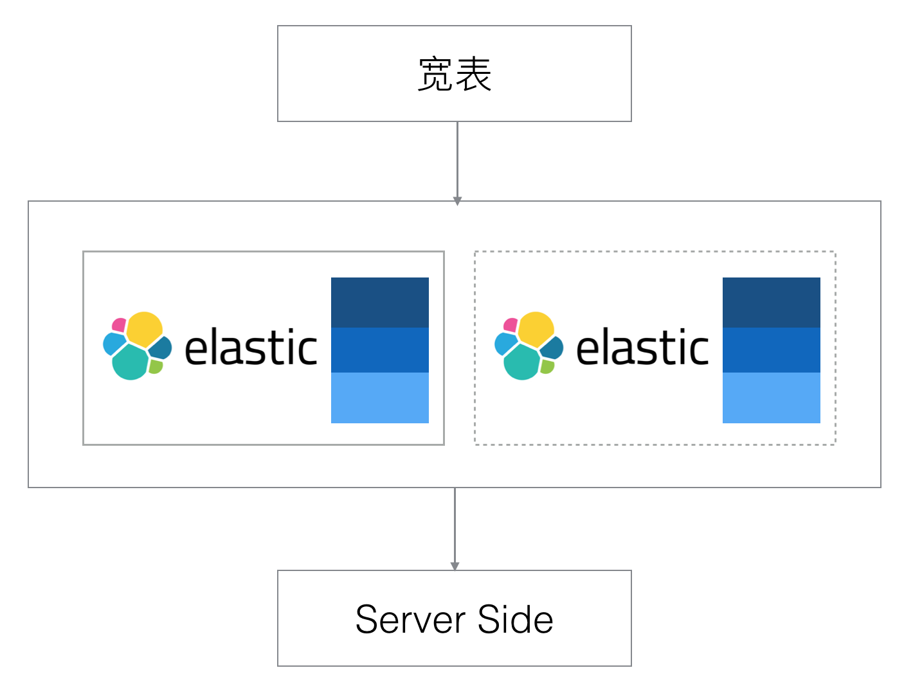

# 设备指纹
#### 服务端架构设计
###### Created by :green_heart: Zhou Changzhi
---

# Introduction

---

# Targets

* Collect Data
* How To Identify You
---

# System Architecture

---

# Elastic Search Index

---

# More About Elastic Search

* replica
* sharding
* reindex
---

# Question
1. 设备数量暴增时的不间断扩容方案
2. 索引数量增多时的不间断扩容方案
3. 索引内容更新时的不间断更新方案
